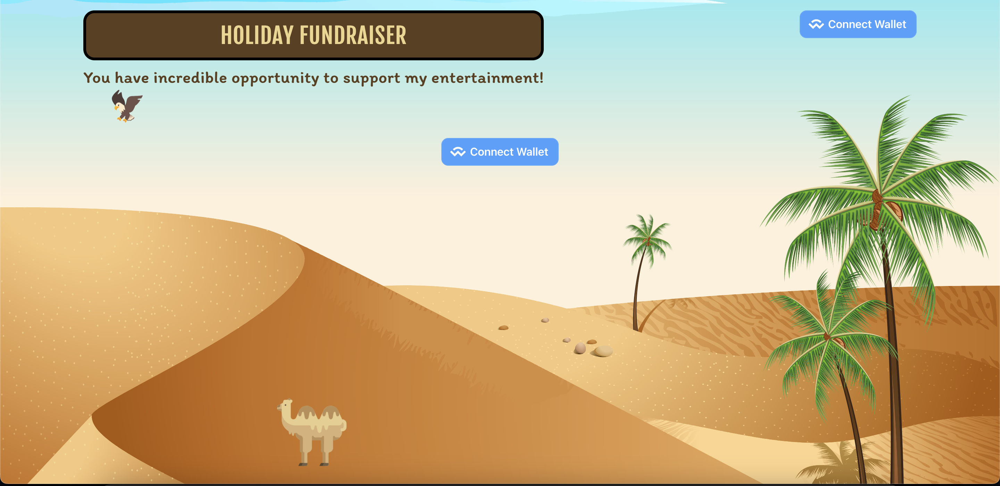

# Fundraising App

It's beautiful Fundraising decentralized app with Solidity smart contract. It's been created to demonstrate and practice my skills.

The smart contract has 100% unit test coverage.



### How to run the project?

Run the following commands:

```bash
$ npx hardhat compile FundraisingToken # compile smart contract
$ npx hardhat node # start a node
$ npx hardhat run --network localhost scripts/deploy.ts # in the second terminal
```

At the second terminal:

```bash
$ npx hardhat run --network localhost scripts/deploy.ts # in the second terminal
```

Copy the contract address and past it into the `./frontend/src/constants/index.ts` file.

Next, start the frontend server in the terminal:

```bash
$ cd frontend
$ yarn start
```

### Dependencies

The project mainly depends on a few OpenZeppelin smart contracts and a Web3Modal library implementing wallet connection.

### Copyrights

All copyrights reserved.
